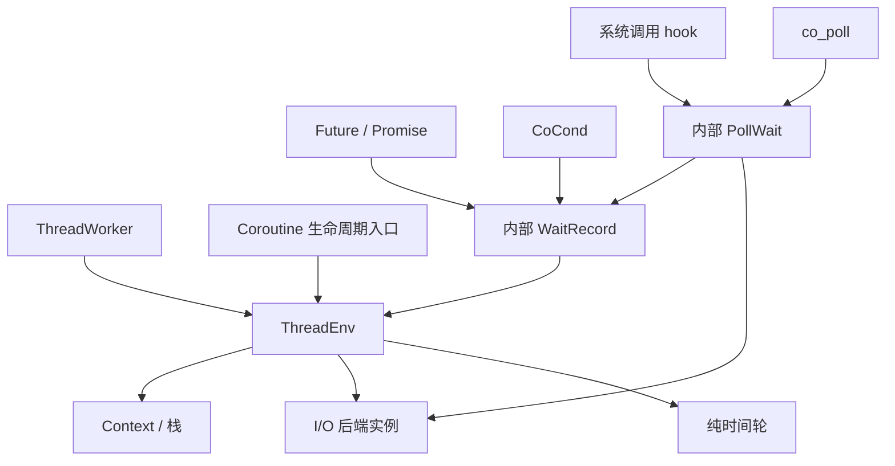

# 运行时模块边界与生命周期

## 核心问题

让结果、等待、执行状态和平台机制各自只有一个所有者，避免 Future、Worker、后端和定时器分别操纵同一协程。

## 结论

保留常用公开 API，由 `ThreadEnv` 统一执行状态转换；Future、条件变量和 poll 通过同一个内部等待记录完成挂起与唤醒；Context、I/O 后端和时间轮只提供机制。

## 最小正文

| 层次 / 模块 | 文件及与原实现的关系 | 职责与边界 |
| --- | --- | --- |
| 入口 / Coroutine | `co_routine.h/.cpp`；保留原生命周期入口，将字段移入私有 `Impl` | 持有函数、栈、执行状态和所属环境；恢复与让出交给所属环境。外部不接触 Context 布局、主协程标记或栈。 |
| 执行 / ThreadEnv | 仍在 `co_routine.h/.cpp`；接收原 Worker 的执行状态和队列 | 唯一维护当前协程、调用关系、任务队列、就绪队列和完成回收队列；驱动事件循环。 |
| 入口 / ThreadWorker | `thread_worker.h/.cpp`；保留 `run_loop()` | 驱动当前线程环境，不再持有另一份当前协程或切换接口。 |
| 结果 / Future、Promise | `co_future.h`；保留结果与异常状态，删除 Continuation | 管理单次结果、异常及结果生命周期；只完成等待记录，不了解栈、Context 链或运行队列。 |
| 条件等待 / CoCond | `co_cond.h/.cpp`；原链表节点移入实现文件 | 管理通知顺序；节点、定时器和等待清理均由实现隐藏。 |
| 等待协调 | 新内部文件 `internal/wait.h`，实现位于 `co_routine.cpp` | `WaitRecord` 表示一次等待，提供挂起、完成及恢复前清理。私有继承链表节点，仅授权对应链表实现及必要的执行层友元访问连接字段。 |
| poll 语义 | `internal/poll.h/.cpp`；从 `co_routine.cpp` 提取，合并 hook 中重复归并逻辑 | 一份 `PollWait` 同时服务 `co_poll` 和 hooked `poll`；封装 fd 合并、注册、回滚、结果回填及计数。 |
| I/O 机制 | `internal/io_backend.h/.cpp`；继续使用原 epoll/kqueue 实现 | 每个实例拥有内核队列、结果缓冲和注册表；事件以 poll 掩码与不透明数据指针传递，内部 `fd()` 入口保留用于检查。定时器和就绪队列属于 ThreadEnv。 |
| 时间机制 | `internal/timer_queue.h`；将原混合事件节点拆为纯 `TimerItem` | `TakeAll` 只返回已到期项，内部完成未到期项的重新入轮；`Remove` 封装幂等移除。不包含平台事件、恢复函数或协程指针。 |
| 事件适配 | `internal/event.h`；收窄原事件记录 | `IoSource` 将 I/O 结果交给等待实现；`WaitTimer` 将到期映射到等待完成。调度语义留在时间轮之外。 |
| Context / 栈 | `internal/context.h/.cpp`、`internal/coctx.h/.cpp`、`internal/coctx_swap.S`、`internal/stack.h` | 复用现有栈 RAII 和平台切换；`Switch(from, to)` 的双方由执行层显式传入，不读取 Worker 或调度 TLS。 |
| 系统调用适配 | `co_hook_sys_call.cpp`，内部声明 `internal/hook_state.h` | 隐藏真实函数解析和 fd 元数据。短临界区内复制或更新元数据，不把共享指针带出锁，也不持锁挂起协程。 |

一次等待的顺序固定为：建立等待记录 → 注册事件或定时器 → 挂起 → 事件源标记完成 → ThreadEnv 放入就绪队列 → 清除事件和定时器注册 → 恢复协程。完成操作幂等；先收集完整 I/O 批次，再恢复协程，避免一个事件回调释放后续事件仍引用的记录。截止时间已经过去时直接完成等待，不将正常超时误报为注册错误。

时间轮先把扫描槽中的节点移入临时侵入式链表，再推进游标，最后分离到期项和未到期项。未到期项按新游标重新入轮，避免在同一次扫描中反复处理；全过程不分配节点内存。执行层只将返回的到期项转换成等待完成，不再处理轮长或重新入轮规则。

回收契约如下：

- `co_create` 返回的协程由调用者拥有；只能在所属线程对未启动或已结束的协程执行 `Reset/Free`。普通 yield 后的协程仍存活，禁止丢弃栈。主协程不能释放，主协程 Reset 保持无操作。
- `schedule/async` 创建的执行协程归 ThreadEnv 回收。任务函数及 Task 析构完成后，Coroutine 只标记结束并让出；`ThreadEnv::Resume` 在切回调用者栈后登记完成链表，登记不分配内存、不让出，实际删除仍由 `Reap` 执行。Task 析构期间可以继续挂起或驱动其他任务。
- 等待中的 Future 必须保持地址和生命周期稳定，最多一个等待者；现有 `noexcept` 移动或析构在违反此契约时终止进程。就绪 Future 在主线程可直接读取；未就绪 Future 在主协程等待抛出 `std::logic_error`。已消费或已移动的 Future 再次读取或等待也抛出 `std::logic_error`。已排队等待者的结果不能被第二个读取者取走。
- Future/Promise 和 CoCond 使用仍限于同一线程。Promise 放弃结果会向已有等待者传递异常；CoCond 必须活得比其等待者更久。
- 本轮没有引入取消机制。退出线程前必须完成活动协程；线程退出不会展开仍挂起的栈。`run_loop(false)` 只处理当前可运行工作，不表示所有 I/O 等待已结束。

信息隐藏采用必要的两种方式：非模板对象通过私有 `Impl` 隐藏布局；模板 Future 仅依赖窄的内部等待定义。没有增加后端继承体系或可替换调度策略。新增等待记录和事件适配用于现有三个等待场景；新增 poll 文件用于消除两个入口的重复实现；新增 hook 内部头用于移除公开的环境指针访问入口。

常用入口名称和参数保持不变，但不承诺 ABI 兼容。`Coroutine::Run/SetMain/GetSysEnvs`、`ThreadEnv::Epoll`、Worker 的 Context 操作不再公开；`co_get_epoll_ct` 仅在内部头声明。直接使用这些实现细节的代码需要调整，两个 echo 示例已改用现有 `co_poll`。

## 附录

### 证据索引

| 结论 | 代码或测试 |
| --- | --- |
| 只有执行层切换、调度和回收 | `co_routine.cpp`：`ThreadEnv::Resume/Yield/RunReady/Reap`、`Coroutine::Run`；`internal/context.cpp`：`RoutineContext::Switch` |
| Future 就绪与挂起语义 | `test/test_runtime_boundaries.cpp`：`ready_main`、`pending_main`、`ready_coroutine`、`pending_future_eventloop`、`abandoned_waiting_future`、`future_single_waiter` |
| 生命周期和回收顺序 | 同上：`suspended_lifetime`、`running_lifetime`、`task_reaping`、`reentrant_task_destruction`、`suspended_task_destruction`、`allocation_free_completion` |
| 单次完成与截止时间 | 同上：`condition_completion`、`expired_wait_deadline` |
| 时间轮只返回到期项、取消后重新添加 | 同上：`timer_expired_only`、`timer_multiple_rotations`、`timer_cancel_and_rearm`，使用显式时间参数验证，不依赖真实长时间等待 |
| 等待节点连接字段不可直接访问 | `internal/wait.h`：私有继承 `LinkItemBase`，授权 `LinkedList<WaitRecord>`；编译检查确认外部访问 `prev/next/link` 均被拒绝 |
| 后端实例隔离 | 同上：`backend_instances`；`internal/io_backend.cpp`：`EpollCtx::Impl` |
| 后端部分注册失败回滚与连接错误码 | `test/test_io_backend.cpp`、`test/test_connect.cpp`；`test/risk/test_hook_syscall_semantics.cpp` 的拒绝连接探测连续执行 32 次 |
| poll 与 hook 语义 | `test/test_co_poll.cpp`、`test/risk/test_poll_semantics.cpp`、`test/risk/test_hook_syscall_semantics.cpp` |
| fd 元数据同步 | `co_hook_sys_call.cpp`：`snapshot_by_fd`、`alloc_by_fd`、`free_by_fd`、`fcntl`、`setsockopt`；`test/risk/diag_hook_fd_race.cpp` |

2026-10-04 本次边界调整验证：macOS arm64 下 `make -B -j4 all`、`make check`、`make risk-check` 均通过，拒绝连接探测完成 32 次；CMake 完整构建及 CTest 7/7 通过。新增三条定时器测试在修改前失败、修改后通过；回收、析构中挂起/重入、不分配内存的既有测试在调整前后均通过。

此前重构验证记录包含 Linux x86_64 构建、基础测试、risk-check，以及 fd TSan 和 Linux ASan/LSan 探针；这些结果属于此前版本，本次边界调整未重跑这些平台与 sanitizer 检查。

### 补充材料

本轮保留墙上时钟和事件循环固定 1ms 等待。它们属于后续评估范围。后端部分注册失败会回滚；撤销失败的记录由后端保留并禁止派发，避免引用已释放的用户数据。内存分配失败路径尚未全面覆盖。

connect 的拒绝连接错误码已修复：poll 返回就绪后读取 `SO_ERROR`，包括仅有 `POLLERR/POLLHUP` 的情况；poll 错误原样返回，仅实际超时使用 `ETIMEDOUT`。

### 待讨论事项

无与本次三项边界调整相关的未决设计问题。
